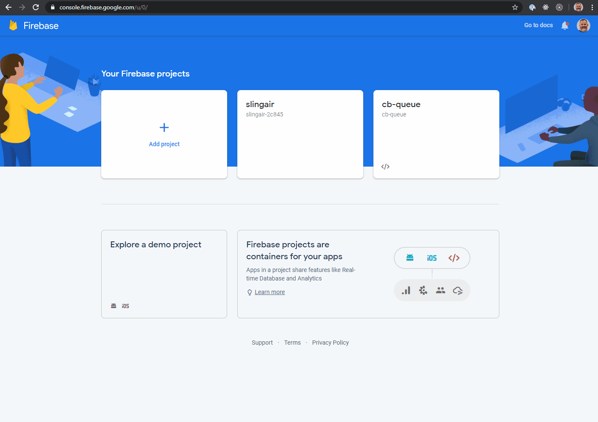

# Exercise 1

This tutorial walk you through the creation of an app that will

1. sign user into app via Google Authentication.

## Part 1 - Set up a Firebase app

Before we write a single line of code, we need to create a firebase project. This project will contain both our database and our authentication.

1. Go to the [Firebase Console](https://console.firebase.google.com/).
2. Click `Create a project` or `Add a project` if you already have projects in our account.

- Project name: `user-app`
- Disable Google Analytics on the following screen
- Continue



## Authentication

You need to enable authentication inside of your Firebase project.

1. From the project overview, select `Authentication`.
2. Click `Set up sign-in method`
3. Select the Google Provider
4. Enable it via the toggle
5. If `Project support email` is empty, click on it. It will add your email by default.
6. Save!


Next, we need to add an app to our firebase Project.

7. Add a webapp by clicking on the `</>` icon in the banner.
8. give the app a nickname: `web-app` _(or anything you like)_
9. Register App!
10. You will be provided with a snippet once the setup is complete.

Because we are using React, all that really interests us the `firebaseConfig` object. It looks something like this:

```js
var firebaseConfig = {
  apiKey: ".......................................",
  authDomain: "...............................",
  databaseURL: ".....................................",
  projectId: "...............",
  storageBucket: "..........................",
  messagingSenderId: "............",
  appId: "..........................................",
};
```

### Add Webapp


11. Copy the contents of that `firebaseConfig` object to the `AppContext.js` file. You will need it in the next exercise.
