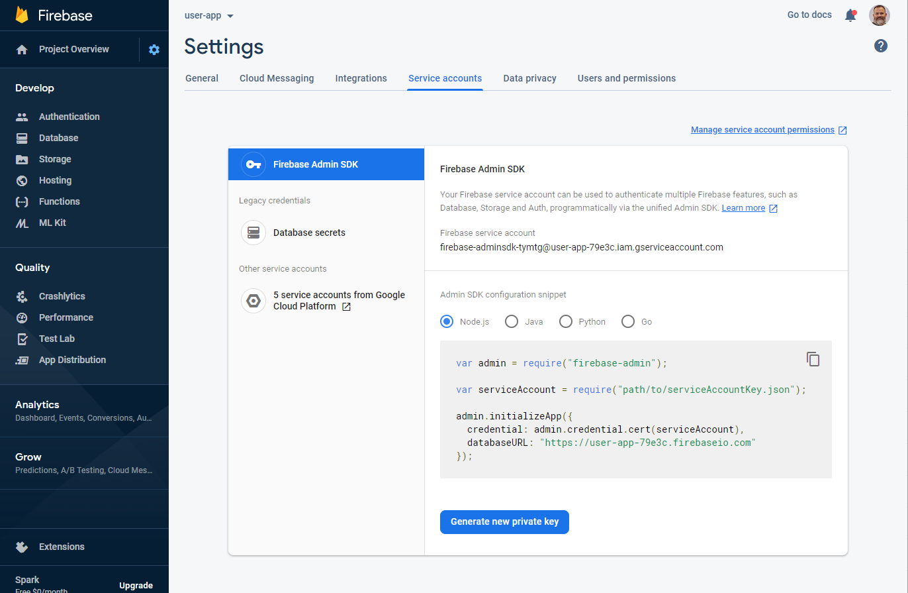
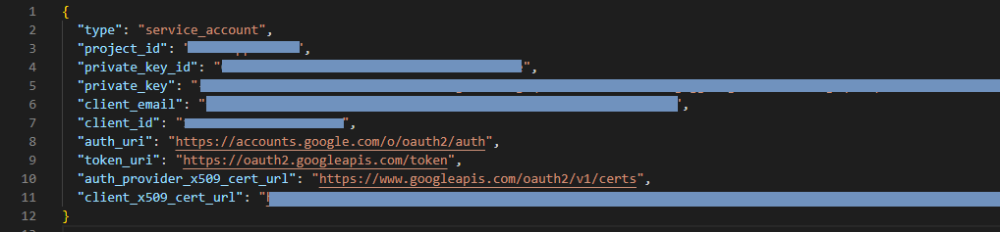
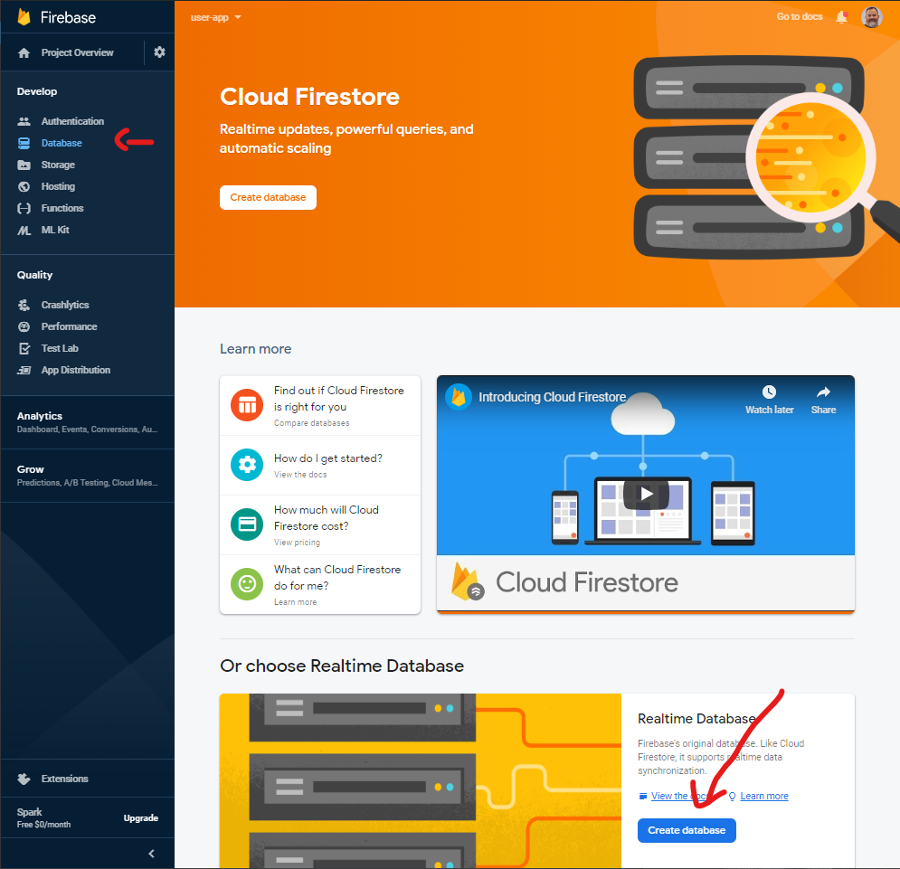
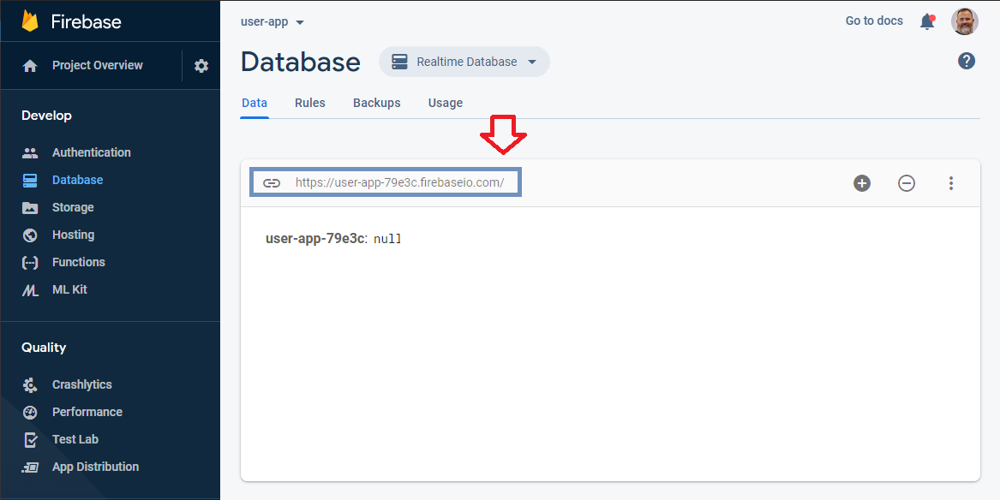

# Exercise 3 - Set up a Firebase Realtime Database

We now have a user signin but we aren't saving any of the data on this user. In fact, we aren't even using our server yet.

Our server already has the two endpoints we need.

```js
GET  '/users'
POST '/users'
```

We will flesh out the two functions to call from these endpoints: `getUsers` and `createUser`.

1. Open `handlers.js`. It contains those two functions.
2. Paste this snippet of code to the top of the file. Under `'use strict';`

```js
const admin = require("firebase-admin");

require("dotenv").config();

admin.initializeApp({
  credential: admin.credential.cert({
    type: "service_account",
    project_id: process.env.FIREBASE_PROJECT_ID,
    private_key_id: process.env.FIREBASE_PRIVATE_KEY_ID,
    private_key: process.env.FIREBASE_PRIVATE_KEY.replace(/\\n/g, "\n"),
    client_email: process.env.FIREBASE_CLIENT_EMAIL,
    client_id: process.env.FIREBASE_CLIENT_ID,
    auth_uri: "https://accounts.google.com/o/oauth2/auth",
    token_uri: "https://oauth2.googleapis.com/token",
    auth_provider_x509_cert_url: "https://www.googleapis.com/oauth2/v1/certs",
    client_x509_cert_url: process.env.FIREBASE_CLIENT_CERT,
  }),
  databaseURL: process.env.FB_DATABASE_URL,
});
```

Before we go any further, we need to go back to the Firebase panel and get all of that data! It is not the same as the credentials we entered client-side.

3. Open the Firebase panel
4. Click on the settings cog, in the sidebar.
5. Select `Service accounts`

You should see something like this:



6. Click on `Generate new private key`. This will save a `json` file to your computer. Open it to see what's inside.



Most of the data is super private and should NEVER be saved in your project. You will add the values to a `.env` file.

7. Rename the `.env.example` to `.env` and add in the values from your `json` file into there. The keys are already named. No need to change any of them. Just add your values.

We need to also get our database url. Go back to the Firebase dashboard and create a "Real-time database."



8. When prompted, select `Start in test mode`.
9. Copy the database URL.



We should now be able to initialize the Node Firebase App.

9. Declare a `db` variable. We will use this to `ref`erence our database.

```js
const db = admin.database();
```

Time to finish up the `createUser` function.

```js
const createUser = async (req, res) => {
  const appUsersRef = db.ref("appUsers");

  appUsersRef.push(req.body).then(() => {
    res.status(200).json({
      status: 200,
      data: req.body,
      message: "new user",
    });
  });
};
```

10. Calling this function from the client (FE). In `AppContext.js`, let's add a `fetch` to the `/users` endpoint, and only `setAppUser` once we get a response.

```diff
  useEffect(() => {
    if (user) {
-     setAppUser({
-       displayName: user.displayName,
-       email: user.email,
-       photoURL: user.photoURL,
-     });
+     fetch(`/users`, {
+       method: 'post',
+       headers: {
+         'Content-Type': 'application/json',
+       },
+       body: JSON.stringify({
+         displayName: user.displayName,
+         email: user.email,
+         photoURL: user.photoURL,
+       }),
+     })
+       .then((res) => res.json())
+       .then((json) => {
+         setAppUser(json.data);
+       });
    }
  }, [user]);
```

This is now functional, but if you test it out, you will notice that everytime someone logs in, a new user will be created in the database. Our server should first verify if the user already exists before adding them. We need a new function `getUser`. This function will be in the backend in the `handlers.js` file.

11. Write a function that gets the user based on their email. To make things a little cleaner, we will extract the actual database query. This will also make it reusable.

```js
const queryDatabase = async (key) => {
  const ref = db.ref(key);
  let data;
  await ref.once(
    "value",
    (snapshot) => {
      data = snapshot.val();
    },
    (err) => {
      console.log(err);
    }
  );

  return data;
};

// this function will return either the user object or false.
const getUser = async (email) => {
  const data = (await queryDatabase(`appUsers`)) || {};
  const dataValue = Object.keys(data)
    .map((item) => data[item])
    .find((obj) => obj.email === email);

  return dataValue || false;
};
```

12. Now let's call it inside of `createUser`

```diff
  const createUser = async (req, res) => {
+   const returningUser = (await getUser(req.body.email));
+   console.log(returningUser);
+   if (returningUser) {
+     res
+       .status(200)
+       .json({ status: 200, data: req.body, message: 'returning user' });
+     return;
+   } else {
     const appUsersRef = db.ref('appUsers');
      appUsersRef.push(req.body).then(() => {
        res.status(200).json({
          status: 200,
          data: req.body,
          message: 'new user',
        });
      });
+   }
  };
```

13. You'll notice that I added a `message` in the response. Let's display that message in the content of the page.

In `AppContext.js`:

```diff
  const AppProvider = ({ children, signInWithGoogle, signOut, user }) => {
    const [appUser, setAppUser] = useState({});
+   const [message, setMessage] = useState('');
    const handleSignOut = () => {
      signOut();
      setAppUser({});
      setMessage('');
    };

    useEffect(() => {
      if (user) {
        fetch(`/users`, {
          method: 'post',
          headers: {
            'Content-Type': 'application/json',
          },
          body: JSON.stringify({
            displayName: user.displayName,
            email: user.email,
            photoURL: user.photoURL,
          }),
        })
          .then((res) => res.json())
          .then((json) => {
            setAppUser(json.data);
+           setMessage(json.message);
          });
      }
    }, [user]);

    return (
-     <AppContext.Provider value={{ appUser, signInWithGoogle, handleSignOut }}>
+     <AppContext.Provider
+       value={{ appUser, signInWithGoogle, handleSignOut, message }}
+     >
        {children}
      </AppContext.Provider>
    );
  };
```

In `App.js`

```diff
  const App = () => {
-   const { appUser, signInWithGoogle, handleSignOut } = useContext(
+   const { appUser, signInWithGoogle, handleSignOut, message } = useContext(
      AppContext
    );

    return (
      <StyledPageWrapper>
        <StyledHeader>
          {appUser && appUser.email ? (
            <StyledUserContainer>
              <Avatar src={appUser.photoURL} />
              <p>
                {appUser.displayName} ({appUser.email})
              </p>
              <button onClick={handleSignOut}>Sign out</button>
            </StyledUserContainer>
          ) : (
            <button onClick={signInWithGoogle}>Sign In</button>
          )}
        </StyledHeader>
-       <StyledContainer>content</StyledContainer>
+       <StyledContainer>{message}</StyledContainer>
      </StyledPageWrapper>
    );
  };
```

And we're done!

## EXTRA - Live updating

This tutorial doesn't include a need for tracking changes to the database, but it would definitely be useful in a more complex app. Here is how you would do that.

```js
useEffect(() => {
  // this connects us to the database, specifically the appUsers obj
  const appUsersRef = firebase.database().ref(`appUsers`);
  appUsersRef.on('value', (snapshot) => {
    const appUsers = snapshot.val();
    // if we had a state item that was tracking allUsers, we would update it here.
    setAllUsers(appUsers);
  }

  return () => {
    // this is where we need to turn off the connection. It's always good to clean up after ourselves.
    const appUsersRef = firebase.database().ref(`appUsers`);
    appUsersRef.off();
  }, [setAllUsers]);
```
